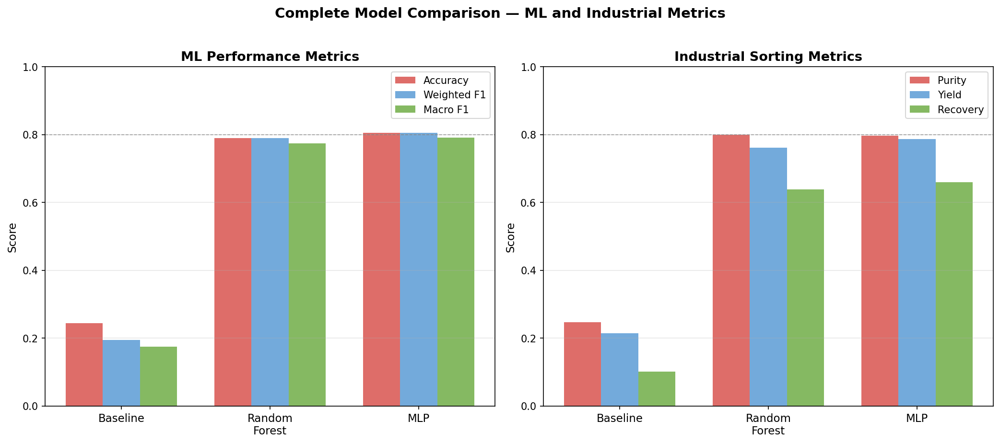

# Machine Learning for High-Performance Optical Sorting

Comparing a rule-based baseline, a Random Forest, and a Multi-Layer Perceptron for
automated waste sorting on the TrashNet dataset — evaluated not just on accuracy, but
on the metrics an actual sorting plant cares about: **material purity, yield, recovery,
robustness to sensor degradation, and inference latency against a 50 ms budget.**

**Author:** Mohamed Tawfeek · **Supervisor:** Dr. Nick Hay · University of Sussex
BSc final-year project.

---

## Results

| Model | Accuracy | Weighted F1 | Macro F1 | Purity | Yield | Recovery |
|---|---|---|---|---|---|---|
| Rule-based HSV baseline | 24.50% | 0.1943 | 0.1749 | 0.2465 | 0.2152 | 0.1011 |
| Random Forest | 78.95% | 0.7898 | 0.7747 | **0.7993** | 0.7612 | 0.6381 |
| Multi-Layer Perceptron | **80.53%** | **0.8055** | **0.7914** | 0.7965 | **0.7876** | **0.6605** |



Per-class F1 on the 380-image test set:

| | cardboard | glass | metal | paper | plastic | trash |
|---|---|---|---|---|---|---|
| Random Forest | 0.86 | 0.72 | 0.71 | 0.87 | 0.81 | 0.69 |
| MLP | 0.88 | 0.75 | 0.72 | 0.86 | 0.83 | 0.70 |

---

## Three findings worth reading the code for

### 1. The feature space, not the classifier, sets the ceiling

The dominant error in **both** models is a near-symmetric glass ↔ metal confusion —
16 errors for the RF (8 each way), 17 for the MLP (10 and 7). Two model families with
very different inductive biases fail at almost exactly the same rate on the same pair,
which points at the representation rather than the model.

The mechanism is visible in the images: transparent glass lets the grey background
dominate its histogram, and metal is specular grey. Both land in the same
low-saturation region of HSV with similarly smooth LBP texture profiles. No amount of
classifier tuning fixes that — it needs a different sensor. `demo_classifier.ipynb`
shows a glass bottle and a tin can that both models get exactly backwards.


### 2. Higher clean accuracy does not mean better deployment

The MLP wins on clean data, but the RF degrades more gracefully under three of the four
image perturbations tested. Accuracy at worst-case severity:

| Perturbation | Random Forest | MLP |
|---|---|---|
| Motion blur | **0.658** | 0.511 |
| Gaussian noise | **0.234** | 0.168 |
| Brightness reduction | **0.418** | 0.358 |
| JPEG compression | 0.253 | **0.300** |

So the model choice is conditional on the imaging environment, not settled by a single
accuracy number.


### 3. The Random Forest wasn't too slow — it was configured wrong

Timed at `n_jobs=-1`, the RF costs 39.0 ms to classify a single image, blowing a 50 ms
end-to-end budget. At `n_jobs=1` the same trained model costs **9.3 ms**, landing at
27.7 ms end-to-end and comfortably inside budget.

Parallelising 200 trees for one 122-feature prediction costs more in scheduling overhead
than it saves. The deployment fix is a one-line configuration change with no retraining.

| Configuration | Classification | End-to-end | Within 50 ms? |
|---|---|---|---|
| RF, `n_jobs=1` | 9.3 ms | 27.7 ms | yes |
| RF, `n_jobs=2` | 36.3 ms | 54.7 ms | no |
| RF, `n_jobs=-1` | 39.4 ms | 57.8 ms | no |
| MLP | 0.10 ms | 18.5 ms | yes |

Feature extraction is the shared 18.2 ms floor in every pipeline — 36% of the budget
before any classifier runs.


---

## Quick start

```bash
pip install -r requirements.txt
jupyter notebook notebooks/demo_classifier.ipynb
```

The trained models and extracted features are committed, so the demo runs immediately
without the dataset or a training pass. It loads an image, shows its HSV and LBP
feature histograms, and runs both classifiers with confidence scores.

To run anything else you need the dataset — see below.

---

## Method

**Features (122 dimensions per image).** Images are resized to 224×224 and converted to
HSV. Three 32-bin normalised channel histograms give 96 colour dimensions; a uniform
Local Binary Pattern descriptor (radius 3, 24 points) gives 26 texture dimensions.

**Split.** 2,527 images, stratified 70/15/15 into 1,769 train / 378 validation / 380
test. `random_state=42` throughout.

**Models.** A hand-tuned HSV threshold classifier as a lower bound; a Random Forest
(200 trees, unbounded depth); an MLP (one hidden layer of 200 units, alpha 0.01,
StandardScaler fitted on training data only). Hyperparameters were chosen by 5-fold
stratified cross-validation on weighted F1, preferring fold-to-fold stability over
marginal mean gains — see the comments in notebooks 04 and 05.

**Industrial metrics.** Purity = precision, Yield = recall, Recovery = TP/(TP+FP+FN).
Colour and texture contribute nearly equally to the RF's decisions (H 22.8%, S 24.7%,
V 25.5%, LBP 27.1%), and cross-group feature correlation stays below 0.14 — so the
texture channel is independent signal, not a proxy for colour.

---

## Repository layout

```
src/
  features.py        canonical 122-dim feature pipeline — imported by every notebook
  perturbations.py   four conveyor-belt failure modes, seeded for reproducibility
notebooks/
  01  data exploration            08  industrial sorting metrics
  02  preprocessing & features    09  final model comparison
  03  rule-based baseline         10  feature correlation analysis
  04  random forest               11  feature importance breakdown
  05  multilayer perceptron       12  Gaussian noise feature analysis
  06  robustness testing          13  thread-count latency scaling
  07  latency & throughput        demo_classifier — start here
results/
  *.pkl, *.npy, *.csv, figures/   committed outputs
```

## Reproducing from scratch

Download TrashNet from https://github.com/garythung/trashnet and extract so that:

```
datasets/dataset-resized/{glass,paper,cardboard,plastic,metal,trash}/
```

Then run the notebooks in numerical order. 01–02 build the feature matrix, 03–05 train
and save the models, and 06–13 depend on those saved artifacts. Notebook 06 re-extracts
features from all 2,527 images 21 times and takes roughly 20 minutes.

---

## Technical notes

**Class ordering.** scikit-learn orders classes alphabetically
(`cardboard, glass, metal, paper, plastic, trash`), which is *not* the order of the
`CLASSES` list. Anything labelling a confusion matrix, classification report or
per-class table uses `CLASS_ORDER = sorted(CLASSES)` and passes it as `labels=` so the
ordering is pinned explicitly. Passing an unsorted list to `target_names` or
`display_labels` silently mislabels every per-class result without raising an error.

**One feature pipeline.** All feature extraction lives in `src/features.py`. Notebook 02
derives the pipeline step by step and then asserts the module reproduces it exactly, so
training and evaluation cannot drift apart. Both the resize filter (Pillow's default
bicubic) and the LBP greyscale conversion path materially affect the resulting feature
vector — LBP shifts about 1.6% under a change of resize filter alone, roughly three
times more than the colour histograms, because it measures local pixel contrast.

**Label format.** Models are trained on string labels, not integers.

**MLP scaling.** The MLP requires `mlp_scaler.pkl`. Call `scaler.transform()` before
predicting, and never refit the scaler on new data.

**Reproducibility.** Gaussian noise draws from an explicitly seeded NumPy `Generator`
via `perturbations.make_perturbation`, not the global random state. All dataset loading
sorts filenames, so splits are identical across platforms.

**Model pickles.** `results/*.pkl` were written with scikit-learn 1.7.2. Loading them on
a different minor version may warn or fail; `requirements.txt` pins accordingly.

---

## Dataset and licence

TrashNet — 2,527 images across six classes, from Thung & Yang (2016),
https://github.com/garythung/trashnet. Not redistributed here.

Code released under the MIT Licence. See [LICENSE](LICENSE).
