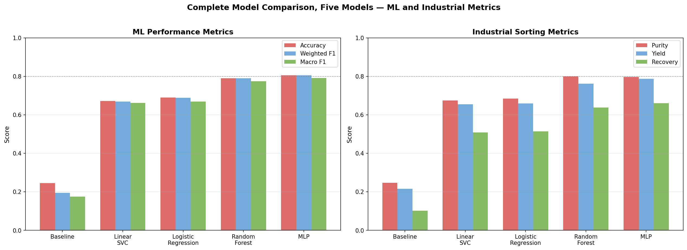
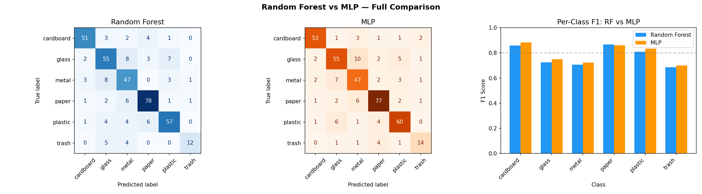
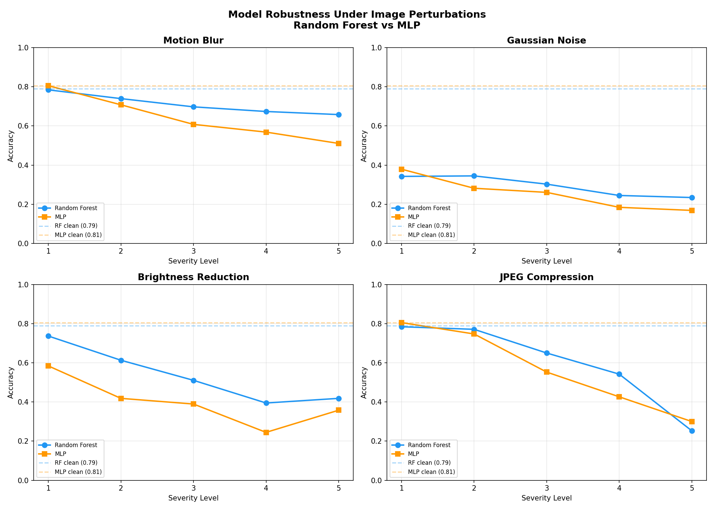
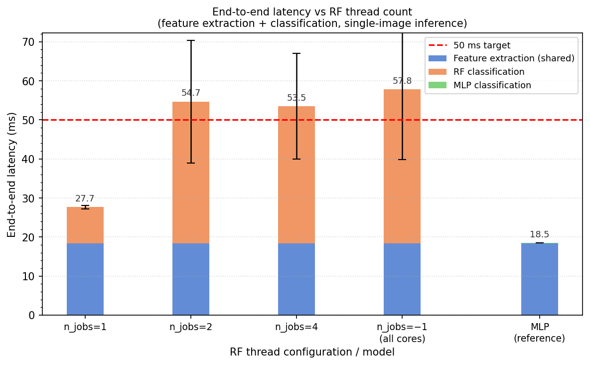
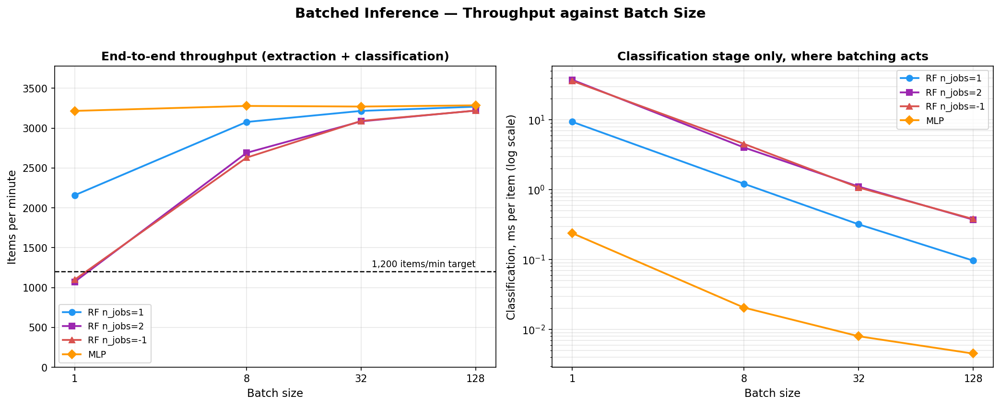
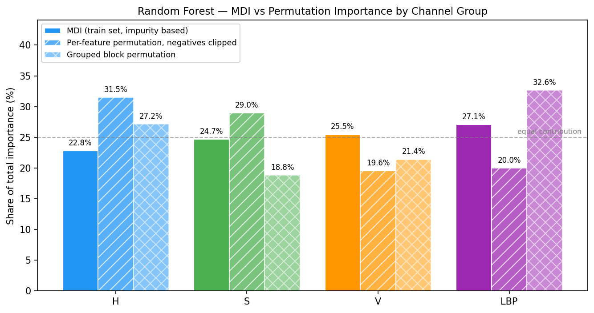

# Machine Learning for High-Performance Optical Sorting

Comparing a rule-based baseline, a Random Forest, and a Multi-Layer Perceptron for
automated waste sorting on the TrashNet dataset, scored on what a sorting plant actually
buys on: **material purity, yield, recovery, robustness to sensor degradation, and
inference latency against a 50 ms budget.**

**Author:** Mohamed Tawfeek · **Supervisor:** Dr. Nick Hay · University of Sussex
BSc final-year project.

**Why handcrafted features and not a CNN.** Fine-tuned CNNs reach the mid-90s on
TrashNet and would win on clean accuracy. The classical pipeline is the point here: it
is interpretable, since feature importances say which part of the representation does
the work; it runs on cheap hardware; it trains on 1,769 images with no augmentation; and
it makes explicit where colour and texture stop carrying information, which is what
tells a plant whether a more expensive sensor is worth buying. The open question, and
the one this evaluation harness is already set up to answer, is whether a CNN keeps its
advantage once robustness and latency sit on the same axes as accuracy.

**How to read the numbers.** TrashNet is single objects on a light background under
controlled lighting. Real belt imagery has overlap, occlusion, contamination and motion.
Everything below is an upper bound on deployment performance, not an estimate of it.

---

## Results

| Model | Accuracy | Weighted F1 | Macro F1 | Purity | Yield | Recovery |
|---|---|---|---|---|---|---|
| Rule-based HSV baseline | 24.50% | 0.1943 | 0.1749 | 0.2465 | 0.2152 | 0.1011 |
| Linear SVC | 67.11% | 0.6693 | 0.6620 | 0.6742 | 0.6540 | 0.5082 |
| Logistic Regression | 68.95% | 0.6879 | 0.6687 | 0.6841 | 0.6591 | 0.5141 |
| Random Forest | 78.95% | 0.7898 | 0.7747 | 0.7993 | 0.7612 | 0.6381 |
| Multi-Layer Perceptron | 80.53% | 0.8055 | 0.7914 | 0.7965 | 0.7876 | 0.6605 |



The two linear rows are there to split the 54-point baseline-to-RF jump into its two
causes. The rule-based baseline compares three HSV channel *means* against hand-set
thresholds; the RF sees three 32-bin histograms plus a 26-bin LBP descriptor and learns
where to cut. A linear model on the identical 122-dim vector gets the representation but
not the non-linearity, so it separates the two contributions:

| From | To | Gain |
|---|---|---|
| Channel means and thresholds (24.50%) | Full descriptor, linear boundary (68.95%) | **+44.45 points** |
| Full descriptor, linear boundary (68.95%) | Full descriptor, Random Forest (78.95%) | **+10.00 points** |

Four fifths of the improvement is the descriptor, not the classifier. That is the same
conclusion finding 1 reaches from the other direction. For external calibration, the
original TrashNet work reported roughly 63% for an SVM on hand-designed features (Thung
and Yang 2016), which the logistic regression here clears by about six points.

Per-class F1 on the 380-image test set:

| | cardboard | glass | metal | paper | plastic | trash |
|---|---|---|---|---|---|---|
| Logistic Regression | 0.87 | 0.62 | 0.58 | 0.76 | 0.65 | 0.53 |
| Random Forest | 0.86 | 0.72 | 0.71 | 0.87 | 0.81 | 0.69 |
| MLP | 0.88 | 0.75 | 0.72 | 0.86 | 0.83 | 0.70 |

The 1.58 point accuracy gap between the RF and the MLP is six images out of 380, and
notebook 15 measures what that is worth instead of asserting it. McNemar's exact test on
the paired test-set predictions gives p = 0.53 — 28 images the RF alone gets right against
34 for the MLP, which is what two equally accurate classifiers disagreeing at random looks
like. Re-running the whole split, train and evaluate loop at seeds 42, 1, 7, 13 and 99
gives 77.95% ± 1.33 accuracy for the RF and 80.05% ± 1.88 for the MLP, with a mean
MLP-minus-RF gap of +2.11 ± 2.73 points. One standard deviation of that gap is worth about
ten images, so the six-image gap on the reported split sits well inside seed noise.

The sign is worth more than the magnitude here: the MLP is ahead on four of the five seeds
and on every metric in the sweep, so the honest reading is a small unconfirmed lean toward
the MLP on clean data rather than a dead heat. Both models are separated from the baseline
by roughly a factor of six on macro Recovery. The differences that actually decide which
model to deploy show up under perturbation, not here.

---

## Three findings worth reading the code for

### 1. The feature space, not the classifier, sets the ceiling

The dominant error in **both** models is a near-symmetric glass to metal confusion: 16
errors for the RF (8 each way), 17 for the MLP (10 and 7). Two model families with very
different inductive biases fail at almost the same rate on the same pair, which points
at the representation rather than the model. Glass and metal are also the two weakest
classes by F1 for both models, while cardboard and paper, which colour alone might be
expected to confuse, sit at 0.86 and above.

The linear baselines in notebook 14 make the point a third time and harder. On the same
features, logistic regression puts 21 images on that off-diagonal and the linear SVC 25,
against 16 and 17 for the non-linear models. Three inductive biases, from a set of
hyperplanes to an ensemble of trees, all break on the same pair, and the weaker the model
the worse it breaks. Nothing about that pattern suggests a classifier is the missing
piece.

The mechanism is visible in the images. Transparent glass lets the grey background
dominate its histogram, and metal is specular grey. Both land in the same low-saturation
region of HSV with similarly smooth LBP texture profiles.
`demo_classifier.ipynb` shows a glass bottle and a tin can that both models get exactly
backwards.

No amount of classifier tuning fixes this. It needs a sensor that sees something other
than reflected visible light, and specifically not NIR. NIR and SWIR sorting identifies
materials by vibrational absorption in CH, OH, NH and SH bonds, which the standard survey
of the field describes as common to all organic molecules (Maier et al. 2024, §III-B.4).
That is what makes the modality good at polymers and cellulose, and it is why the same
survey's sensor taxonomy records no NIR application to metal or glass: both are inorganic
and present no such bands to read.

Plants separate this pair with two mechanisms rather than one better camera. Metal comes
out mechanically — magnetic separation first, then eddy-current separation, which induces
circulating currents in non-ferrous particles and deflects them off the belt (Smith et al.
2019) — or by inductive sensing where a sensor-based ejector is used instead (Friedrich et
al. 2022). Glass is then graded optically, but in transmission rather than reflection,
which is how colour cullet sorting works (Maier et al. 2024, §III-B.2). Where metals have
to be told apart from each other rather than merely detected, combined electromagnetic and
dual-energy X-ray transmission sensing separates aluminium, magnesium, copper and brass
(Mesina et al. 2007; Maier et al. 2024, §II-C.2). XRT discriminates by effective atomic
number, not by density.



### 2. Clean accuracy does not decide the deployment question

Accuracy at worst-case severity for each perturbation:

| Perturbation | Random Forest | MLP |
|---|---|---|
| Motion blur | 0.658 | 0.511 |
| Gaussian noise | 0.234 | 0.168 |
| Brightness reduction | 0.418 | 0.358 |
| JPEG compression | 0.253 | 0.300 |

Two of these rows are noise. Chance on six classes is 16.7%, so at worst-case Gaussian
noise both models have already failed and the RF's lead is a lead inside a region where
nothing works. The JPEG margin is small enough to ignore. The row that carries real
information is motion blur, where the RF is 14.7 points ahead of a model it cannot be
separated from on clean data, with brightness reduction showing the same ordering from
the mildest severity onward.

Notebook 12 explains why noise is so destructive. HSV histograms flatten toward uniform
as pixels scatter across bins, while the LBP histogram collapses in the opposite
direction, into its non-uniform catch-all bin, because noise breaks the smooth pixel
transitions that produce uniform codes. Both halves of the descriptor lose their shape at
the same severity, which is why the drop from clean to mild noise is a cliff rather than
a slope. That makes noise a hardware problem (illumination and sensor quality) or a
pre-filtering problem, not something the classifier can absorb.

So the model choice is conditional on the imaging environment. In a controlled enclosure,
take the MLP for its latency headroom. Where blur or illumination cannot be controlled,
take the RF.



### 3. Feature extraction, not the classifier, owns the latency budget

Feature extraction costs 18.2 ms and is identical in every pipeline, so 36% of the 50 ms
budget is spent before any classifier runs. For the MLP the classifier is a rounding
error at 0.10 ms, which means the descriptor is effectively the whole pipeline. Any
further latency work has to go there — and one of the obvious routes is now measured and
closed: batching does nothing for extraction, because `src/features.py` is a per-image
loop and costs 18.3 ms per item whether it is handed 1 image or 128. That leaves a
compiled implementation, a cheaper descriptor, or parallelising across images rather than
within one.

The RF is the interesting case, because its cost depends on a threading setting rather
than on the model:

| Configuration | Classification | End-to-end | Within 50 ms? |
|---|---|---|---|
| RF, `n_jobs=1` | 9.3 ms | 27.7 ms | yes |
| RF, `n_jobs=2` | 36.3 ms | 54.7 ms | no |
| RF, `n_jobs=-1` | 39.4 ms | 57.8 ms | no |
| MLP | 0.10 ms | 18.5 ms | yes |

Parallelising 200 trees for one 122-feature prediction costs more in scheduling overhead
than it saves, so the as-trained model misses a budget the same weights meet at
`n_jobs=1`. Converted into the number a plant asks for, a 2 m/s belt at 10 cm spacing
needs 1,200 items/min; sequential single-image throughput is 2,166/min for the RF at
`n_jobs=1`, 3,243/min for the MLP, and 1,038/min for the RF as trained.



**Batching was the open question here, and it does not reverse the threading result.** An
earlier version of this section predicted that it would. Notebook 07 now measures batch
sizes 1, 8, 32 and 128 with extraction and classification timed separately, one warm-up
call discarded per configuration and 50 timed runs each. Classification cost, ms per item:

| Batch | RF `n_jobs=1` | RF `n_jobs=2` | RF `n_jobs=-1` | MLP |
|---|---|---|---|---|
| 1 | 9.385 | 37.520 | 36.170 | 0.239 |
| 8 | 1.218 | 4.025 | 4.536 | 0.021 |
| 32 | 0.321 | 1.113 | 1.077 | 0.008 |
| 128 | **0.097** | 0.374 | 0.382 | 0.005 |

Batching amortises the dispatch overhead exactly as expected — the parallel configurations
improve roughly a hundredfold from batch 1 to batch 128 — but they never overtake. At batch
128 `n_jobs=1` is still 3.9× faster per item than either. The work being divided, 128 rows
through 200 trees, stays smaller than the cost of handing it to a thread pool across the
whole range a conveyor would plausibly use. The prediction was wrong; the single-threaded
recommendation holds under batching.

What batching does change is which constraint binds. Per-item amortised throughput,
items/min:

| Batch | RF `n_jobs=1` | RF `n_jobs=2` | RF `n_jobs=-1` | MLP |
|---|---|---|---|---|
| 1 | 2,158 | 1,073 | 1,099 | 3,217 |
| 8 | 3,077 | 2,690 | 2,630 | 3,279 |
| 32 | 3,216 | 3,085 | 3,091 | 3,271 |
| 128 | 3,269 | 3,221 | 3,220 | 3,286 |

At batch 1 the RF as trained misses the 1,200 target. From batch 8 every configuration
clears it, and by batch 32 all four sit within 7% of each other, because extraction pins
the ceiling at roughly 3,290 items/min no matter what the classifier does. So the thread
count is a per-item latency decision, not a throughput decision — it stops mattering for
throughput as soon as the line batches at all.

Read all of this as a characterisation of one machine, not a deployment recommendation.
Timings are on an i9-9900KF with 16 logical cores, the batch-1 column above reproduces the
single-image table within run-to-run noise, and none of these numbers include acquisition,
transmission or actuator firing. The model also assumes extraction and classification run
in sequence; a real system would overlap them, which raises the ceiling but does not change
the ordering.



---

## Quick start

```bash
pip install -r requirements.txt
jupyter notebook notebooks/demo_classifier.ipynb
```

The trained models and extracted features are committed, so the demo runs immediately
without the dataset or a training pass. It loads an image, shows its HSV and LBP feature
histograms, and runs both classifiers with confidence scores.

To run anything else you need the dataset. See below.

---

## Method

**Features (122 dimensions per image).** Images are resized to 224×224 and converted to
HSV. Three 32-bin normalised channel histograms give 96 colour dimensions; a uniform
Local Binary Pattern descriptor (radius 3, 24 points) gives 26 texture dimensions.

**Split.** 2,527 images, stratified 70/15/15 into 1,769 train / 378 validation / 380
test. `random_state=42` throughout. Hyperparameters were selected by 5-fold stratified
cross-validation on the training partition only; the validation split was used for
development sanity checks and the test set only after the configurations were fixed.

**Models.** A hand-tuned HSV threshold classifier as a lower bound; a logistic regression
and a linear SVC (both C tuned by the same cross-validation, both wrapped in a pipeline
with a StandardScaler so the scaler is refitted inside each fold); a Random Forest (200
trees, unbounded depth); an MLP (one hidden layer of 200 units, alpha 0.01,
StandardScaler fitted on training data only). Where cross-validation means were within
noise of each other I took the configuration with the lowest fold-to-fold standard
deviation rather than the highest mean. See the comments in notebooks 04 and 05; notebook
14 applies the same rule in code rather than by hand.

The linear models are not candidates for deployment. They exist to hold the feature vector
fixed while the decision boundary changes, which is the only way to say how much of the
project's headline improvement belongs to the descriptor and how much to the classifier.

**Shared code.** Feature extraction lives in `src/features.py` and the Purity/Yield/
Recovery definitions in `src/metrics.py`. `src/metrics.py` holds notebook 08's function
verbatim so that later notebooks score against the same definition instead of copying it;
notebook 08 itself is unchanged, and notebook 14 asserts that the module reproduces the
committed `rf_industrial_metrics.csv` from the committed confusion matrix, so the two
cannot drift apart unnoticed.

**Industrial metrics.** Purity = precision, Yield = recall. Both follow the
sensor-based sorting literature (Küppers et al. 2021; Maier et al. 2024), where they are
the standard pair and trade off against each other. Recovery here is the composite
TP/(TP+FP+FN), which penalises output contamination and lost material in one number.

**Feature contributions.** Mean impurity decrease splits the RF's decisions almost evenly
across the four groups (H 22.8%, S 24.7%, V 25.5%, LBP 27.1%). Permutation importance does
not agree: H 36.2%, S 32.7%, LBP 20.6%, V 10.5%. MDI is measured on data the trees have
already fitted and favours features offering more split points, so the disagreement is
expected and the permutation numbers are the ones to trust. They say colour carries about
four fifths of the RF's recoverable signal, and that V is largely redundant once H and S
are present.

Two things stop 20.6% from being read as texture being marginal. Single-feature
permutation understates any group whose features are redundant with each other, because
shuffling one bin leaves its neighbours to carry the signal, and LBP is by far the most
internally correlated group (mean |r| 0.531 within LBP against 0.14 to 0.21 within the
colour channels, notebook 10) — so 20.6% is a floor for texture, not an estimate. And the
MLP, which uses all 122 inputs at once rather than one per split, spreads its permutation
importance almost evenly (H 24.9%, S 26.0%, V 21.1%, LBP 28.1%) with texture the single
largest group. The claim that texture is independent signal rather than a proxy for colour
rests on cross-group correlation staying below 0.14 and is unchanged; what the permutation
numbers revise is how much of the RF's accuracy that independent signal is worth.



Permutation importance is computed on the test partition with 30 repeats per feature,
scored on weighted F1, for both models (notebook 11).

---

## Repository layout

```
src/
  features.py        canonical 122-dim feature pipeline, imported by every notebook
  metrics.py         canonical Purity / Yield / Recovery definitions
  perturbations.py   four conveyor-belt failure modes, seeded for reproducibility
notebooks/
  01  data exploration            09  final model comparison
  02  preprocessing & features    10  feature correlation analysis
  03  rule-based baseline         11  feature importance: MDI + permutation
  04  random forest               12  Gaussian noise feature analysis
  05  multilayer perceptron       13  thread-count latency scaling
  06  robustness testing          14  linear baseline (LogReg, LinearSVC)
  07  latency & throughput        15  McNemar test + multi-seed sweep
  08  industrial sorting metrics  demo_classifier, start here
results/
  *.pkl, *.npy, *.csv, figures/   committed outputs
```

## Reproducing from scratch

Download TrashNet from https://github.com/garythung/trashnet and extract so that:

```
datasets/dataset-resized/{glass,paper,cardboard,plastic,metal,trash}/
```

Then run the notebooks in numerical order. 01 and 02 build the feature matrix, 03 to 05
train and save the models, and 06 onward depend on those saved artifacts. Notebook 06
re-extracts features from all 2,527 images 21 times and takes roughly 20 minutes. Notebook
15 trains ten fresh models of its own and takes a few minutes; it reads nothing from
`results/` for that part, so the committed pickles are never overwritten.

---

## Technical notes

**One feature pipeline.** All feature extraction lives in `src/features.py`. Notebook 02
derives the pipeline step by step and then asserts the module reproduces it exactly, so
training and evaluation cannot drift apart. Both the resize filter (Pillow's default
bicubic) and the LBP greyscale conversion path materially affect the resulting feature
vector: LBP shifts about 1.6% under a change of resize filter alone, roughly three times
more than the colour histograms, because it measures local pixel contrast. This is not
hypothetical. An earlier version of the pipeline used different filters in different
stages, which is what the assert now exists to catch.

**Label format.** Models are trained on string labels, not integers.

**MLP scaling.** The MLP requires `mlp_scaler.pkl`. Call `scaler.transform()` before
predicting, and never refit the scaler on new data.

**Reproducibility.** Gaussian noise draws from an explicitly seeded NumPy `Generator` via
`perturbations.make_perturbation`, not the global random state. All dataset loading sorts
filenames, so splits are identical across platforms. Every number reported here comes
from a single split at `random_state=42`.

**Model pickles.** `results/*.pkl` were written with scikit-learn 1.7.2. Loading them on
a different minor version may warn or fail; `requirements.txt` pins accordingly.

---

## References

Friedrich, K., Koinig, G., Pomberger, R. and Vollprecht, D. (2022). Qualitative analysis
of post-consumer and post-industrial waste via near-infrared, visual and induction
identification with experimental sensor-based sorting setup. *MethodsX* 9, 101686.
https://doi.org/10.1016/j.mex.2022.101686

Küppers, B., Schlögl, S., Friedrich, K., Lederle, L., Pichler, C., Freil, J., Pomberger,
R. and Vollprecht, D. (2021). Influence of material alterations and machine impairment on
throughput related sensor-based sorting performance. *Waste Management & Research* 39(1),
122–129. https://doi.org/10.1177/0734242X20936745

Maier, G., Gruna, R., Längle, T. and Beyerer, J. (2024). A survey of the state of the art
in sensor-based sorting technology and research. *IEEE Access* 12, 6473–6493.
https://doi.org/10.1109/ACCESS.2024.3350987

Mesina, M.B., de Jong, T.P.R. and Dalmijn, W.L. (2007). Automatic sorting of scrap metals
with a combined electromagnetic and dual energy X-ray transmission sensor. *International
Journal of Mineral Processing* 82(4), 222–232.
https://doi.org/10.1016/j.minpro.2006.10.006

Smith, Y.R., Nagel, J.R. and Rajamani, R.K. (2019). Eddy current separation for recovery
of non-ferrous metallic particles: a comprehensive review. *Minerals Engineering* 133,
149–159. https://doi.org/10.1016/j.mineng.2018.12.025

Thung, G. and Yang, M. (2016). Classification of trash for recyclability status. CS229
project report, Stanford University. https://github.com/garythung/trashnet

---

## Dataset and licence

TrashNet, 2,527 images across six classes, from Thung & Yang (2016),
https://github.com/garythung/trashnet. Not redistributed here.

Code released under the MIT Licence. See [LICENSE](LICENSE).
