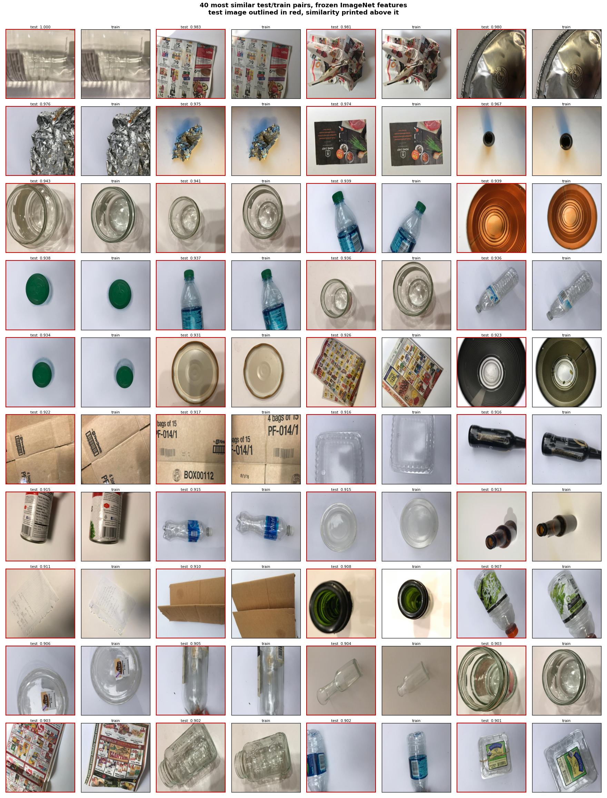

# Machine Learning for High-Performance Optical Sorting

Comparing a rule-based baseline, two linear models, a Random Forest and a Multi-Layer
Perceptron for automated waste sorting on the TrashNet dataset, scored on what a sorting
plant actually buys on: **material purity, yield, recovery, robustness to sensor
degradation, and inference latency against a 50 ms budget.** A fine-tuned CNN is included
as a reference point on all three axes.

**Author:** Mohamed Tawfeek · **Supervisor:** Dr. Nick Hay · University of Sussex
BSc final-year project.

**What the CNN reference point costs, and what it settles.** Fine-tuned CNNs reach the
mid-90s on TrashNet, and notebook 16 confirms it on this split: a ResNet18 fine-tuned on
the same 1,769 training images reaches 95.00% against 80.53% for the best classical model.
That headline is the seed-42 split every other row reports; across five seeds notebook 17
puts it at 92.16% ± 1.80, still twelve points clear of the MLP's 80.05% ± 1.88. Earlier
versions of this README left open whether that advantage survives once robustness and latency
sit on the same axes as accuracy. It does, on both. The ResNet18 is ahead of the Random
Forest and the MLP at every severity of all four perturbation families, and on eight CPU
threads its end-to-end latency of 20.3 ms fits inside the 50 ms budget, though on one thread
it does not. It is not a sixth candidate model and is marked as a reference wherever it
appears.

That leaves the classical pipeline with a narrower and more honest case than this README
used to make for it. It is interpretable, since feature importances say which part of the
representation does the work; it trains in seconds on a CPU with no accelerator anywhere in
the loop; and it is small enough to reason about end to end. What it is not is the faster
or the more robust option. The reason to read it is finding 1, whose claim about the accuracy
ceiling the CNN confirms and whose claim about glass and metal it leaves standing, since that
pair accounts for as large a share of the CNN's errors as of anything else measured here.

**How to read the numbers.** TrashNet is single objects on a light background under
controlled lighting. Real belt imagery has overlap, occlusion, contamination and motion.
Everything below is an upper bound on deployment performance, not an estimate of it.

---

## Results

| Model | Accuracy | Weighted F1 | Macro F1 | Purity | Yield | Recovery |
|---|---|---|---|---|---|---|
| Rule-based HSV baseline | 24.50% | 0.1943 | 0.1749 | 0.2465 | 0.2152 | 0.1011 |
| Linear SVC | 67.11% | 0.6693 | 0.6620 | 0.6742 | 0.6540 | 0.5082 |
| Logistic Regression | 68.95% | 0.6879 | 0.6687 | 0.6841 | 0.6591 | 0.5141 |
| Random Forest | 78.95% | 0.7898 | 0.7747 | 0.7993 | 0.7612 | 0.6381 |
| Multi-Layer Perceptron | 80.53% | 0.8055 | 0.7914 | 0.7965 | 0.7876 | 0.6605 |
| *ResNet18 (reference, not a candidate)* | *95.00%* | *0.9498* | *0.9408* | *0.9517* | *0.9324* | *0.8899* |

The last row is a reference point, not a sixth competitor. It exists to establish the
ceiling and to test the representation claim in finding 1, and it is scored on exactly the
same test partition through exactly the same `src/metrics.py` definitions as everything
above it. Notebook 16 asserts that partition is identical rather than assuming it: it
indexes the committed feature matrix by its own test indices, scores the committed Random
Forest pickle on the result, and checks it against the committed
`results/rf_confusion_matrix.npy`.

Every row above is the seed-42 split, so all six are directly comparable, but the CNN row is
the most favourable of its five seeds and should be read with the spread notebook 17 measures:
92.16% ± 1.80 accuracy, against 80.05% ± 1.88 for the MLP and 77.95% ± 1.33 for the RF from
notebook 15. The accuracy ordering is unaffected. Individual error counts drawn from this row
are not, and finding 1 says where that matters.

One more row is worth knowing about even though it is not scored on the industrial metrics.
Notebook 17 fits a logistic regression to the 512-dim penultimate activations of an ImageNet
ResNet18 with no fine-tuning at all, and it reaches 85.00% on the seed-42 split and
83.37% ± 0.96 across five seeds, against 80.05% ± 1.88 for the MLP. An off-the-shelf backbone
used purely as a fixed feature extractor, with no network training anywhere in the loop and
one linear model on top, clears the handcrafted pipeline by about three points. It is the
cheapest thing in this repository that does so, and it is the cleanest evidence for finding 1,
because it changes only the representation and holds the classifier family fixed.


The two linear rows are there to split the 54-point baseline-to-RF jump into its causes.
Three things change between the rule-based baseline and the Random Forest: the input goes
from three HSV channel means to three 32-bin histograms plus a 26-bin LBP descriptor, the
decision boundary goes from hand-set thresholds to a learned one, and that boundary goes
from linear to non-linear. Holding each fixed in turn separates them:

| Step | What changes | Accuracy | Gain |
|---|---|---|---|
| Channel means, hand-set thresholds | | 24.50% | |
| Channel means, learned linear boundary | thresholds become learned | 42.11% | +17.61 points |
| Full descriptor, learned linear boundary | 3 features become 122 | 68.95% | +26.84 points |
| Full descriptor, Random Forest | boundary becomes non-linear | 78.95% | +10.00 points |
| Learned representation, fine-tuned CNN | the descriptor itself is learned | 95.00% | +16.05 points |

One row sits off this path and is worth reading against the second one. Substituting the
frozen ImageNet representation for the 122-dim descriptor, holding the classifier at a
logistic regression, takes 68.95% to 85.00%. That is a representation change with nothing
else moving, which is the clean version of the step the last row of the table conflates with
a change of model family.

The descriptor is still the largest single step at +26.84 points, so the earlier reading
survives, but it is worth about half of the total rather than the four fifths a three-row
version of this table implies. The second largest step is learning the boundary at all:
fitting a logistic regression to the same three channel means the thresholds see is worth
+17.61 points on its own, which says the rule-based floor is low partly because the
thresholds were set by hand and not only because three channel means are a poor
representation. Non-linearity is the smallest step at +10.00 points, which is the same
shape of result finding 1 reaches from the other direction: once the representation is
fixed, changing the classifier family buys progressively less. These are the gains along
one path through the three changes rather than three independent contributions. Adding the
descriptor before learning the boundary would divide the same 54.45 points differently,
because the two interact.

The last row is a different kind of step from the three above it, which is why it is worth
reading separately. Every earlier row holds the input representation fixed and changes what
is done with it; the CNN row replaces the representation with one learned from the pixels,
so it changes the model family at the same time and cannot be attributed cleanly to either.
What it does establish is the size of what the descriptor was leaving on the table. Learning
the representation is worth +16.05 points, more than the non-linearity step and the
learned-boundary step. It is also the only step that moves glass and metal, though notebook
17 shows that step is doing two things at once: the gain needs both ImageNet pretraining and
fine-tuning on TrashNet, and neither on its own gets close. A ResNet18 trained on these 1,769
images with no ImageNet reaches 79.37% ± 1.88 across five seeds, against the MLP's
80.05% ± 1.88, so this row is not evidence that the descriptor can be beaten using this
dataset alone. That step also does not change how much of the remaining error the glass and
metal pair accounts for, which finding 1 takes up.

For external calibration, the original TrashNet work reported roughly 63% for an SVM on
hand-designed features (Thung and Yang 2016), which the logistic regression here clears by
about six points.

Per-class F1 on the 380-image test set:

| | cardboard | glass | metal | paper | plastic | trash |
|---|---|---|---|---|---|---|
| Logistic Regression | 0.87 | 0.62 | 0.58 | 0.76 | 0.65 | 0.53 |
| Random Forest | 0.86 | 0.72 | 0.71 | 0.87 | 0.81 | 0.69 |
| MLP | 0.88 | 0.75 | 0.72 | 0.86 | 0.83 | 0.70 |
| *ResNet18 (reference)* | *0.97* | *0.95* | *0.94* | *0.96* | *0.94* | *0.87* |

The 1.58 point accuracy gap between the RF and the MLP is six images out of 380, and
notebook 15 measures what that is worth instead of asserting it. McNemar's exact test on
the paired test-set predictions gives p = 0.53: 28 images the RF alone gets right against
34 for the MLP, which is what two equally accurate classifiers disagreeing at random looks
like. Re-running the whole split, train and evaluate loop at seeds 42, 1, 7, 13 and 99
gives 77.95% ± 1.33 accuracy for the RF and 80.05% ± 1.88 for the MLP, with a mean
MLP-minus-RF gap of +2.11 ± 2.73 points. One standard deviation of that gap is worth about
ten images, so the six-image gap on the reported split sits well inside seed noise.

The sign is worth more than the magnitude here: the MLP is ahead on four of the five seeds
and on every metric in the sweep, so the honest reading is a small unconfirmed lean toward
the MLP on clean data rather than a dead heat. Both models are separated from the baseline
by roughly a factor of six on macro Recovery. The differences that actually decide which
model to deploy show up under perturbation, not here.

---

## Three findings worth reading the code for

### 1. The feature space, not the classifier, sets the ceiling

The dominant error in **both** models is a near-symmetric glass to metal confusion: 16
errors for the RF (8 each way), 17 for the MLP (10 and 7). Two model families with very
different inductive biases fail at almost the same rate on the same pair, which points
at the representation rather than the model. Glass and metal are also the two weakest
classes by F1 for both models, while cardboard and paper, which colour alone might be
expected to confuse, sit at 0.86 and above.

The linear baselines in notebook 14 make the point a third time and harder. On the same
features, logistic regression puts 21 images on that off-diagonal and the linear SVC 25,
against 16 and 17 for the non-linear models. Three inductive biases, from a set of
hyperplanes to an ensemble of trees, all break on the same pair, and the weaker the model
the worse it breaks. The structure of the failure changes as well as its size. Where the
RF and MLP trade images between glass and metal roughly evenly, the linear models turn
glass into an attractor: logistic regression sends 14 metal images and 12 plastic ones
into it while the reverse directions stay small. Nothing about that pattern suggests a
classifier is the missing piece.


The mechanism is visible in the images. Transparent glass lets the grey background
dominate its histogram, and metal is specular grey. Both land in the same low-saturation
region of HSV with similarly smooth LBP texture profiles.
`demo_classifier.ipynb` shows a glass bottle and a tin can that both models get exactly
backwards.

**The CNN reference point moves the pair, and notebook 17 audits how far.** Notebook 16
fine-tunes a ResNet18 on the same training images and scores it on the same 380 test images.
On that off-diagonal it puts 2 images, one each way, against 16 for the RF, 17 for the MLP,
21 for logistic regression and 25 for the linear SVC. That single number turned out to be
the least durable in this repository, so it is reported here with the two things that
qualify it, both from notebook 17:

| Model | pair total | total errors | pair as share of errors |
|---|---|---|---|
| Linear SVC | 25 | 125 | 20.0% |
| Logistic Regression | 21 | 118 | 17.8% |
| Random Forest | 16 | 80 | 20.0% |
| MLP | 17 | 74 | 23.0% |
| *ResNet18 from scratch, no ImageNet, five seeds* | *17.4 ± 4.2* | *78.4* | *22.1%* |
| *Frozen ImageNet features, no fine-tuning, five seeds* | *13.8 ± 2.4* | *63.2* | *21.8%* |
| *ResNet18 fine-tuned, seed 42* | *2* | *19* | *10.5%* |
| *ResNet18 fine-tuned, five seeds* | *7.6 ± 4.4* | *29.8 ± 6.8* | *24.2% ± 11.8* |

The share column is the one to read across rows, and it is the column an earlier version of
this section did not have.

The first qualification is that 2 is the best of five seeds. Re-running the whole split,
train and evaluate loop at seeds 42, 1, 7, 13 and 99, which is the same instrument notebook
15 used to refuse the RF-versus-MLP gap, gives a pair count of 7.6 ± 4.4 and a worst seed of
13. Thirteen is inside the range the RF and MLP occupy. So the honest reading is that the
fine-tuned CNN roughly halves the pair on average, with a spread wide enough to reach the
classical models, not that it collapses it eightfold. Accuracy is far steadier: 92.16% ± 1.80
against 80.05% ± 1.88 for the MLP and 77.95% ± 1.33 for the RF, so the accuracy advantage is
twelve points against seed noise of about two and is not in question.

The second qualification is that the images were not held fixed. The ResNet18 starts from
ImageNet, so it saw 1.28 million images before it saw one from TrashNet, and notebook 17
separates the two ingredients. ImageNet's representation on its own, with a logistic
regression fitted on top and no fine-tuning, puts 13.8 ± 2.4 on the pair, and reaches
83.37% ± 0.96 accuracy, which is about three points above the MLP. A ResNet18 that learns its
representation from the 1,769 TrashNet training images alone puts 17.4 ± 4.2, and at
79.37% ± 1.88 accuracy it does not beat the MLP's 80.05% ± 1.88. Both are swept over the same
five seeds as the row above them. So the two ingredients do different things. On accuracy,
ImageNet alone is already worth more than the whole handcrafted pipeline and TrashNet alone is
worth less than it. On the pair, neither ingredient separately moves the count below where the
RF and MLP sit; only the combination moves it, and how far depends on the seed.

Both qualifications are about the absolute count, and the share of each model's errors tells
a third thing. Notebook 17 computes the pair as a fraction of total errors for every model
here: 17.8% for logistic regression, 20.0% for the linear SVC, 20.0% for the Random Forest,
23.0% for the MLP, 21.8% for the frozen ImageNet probe, 22.1% for the from-scratch ResNet18,
and 24.2% ± 11.8 across the fine-tuned network's five seeds. Seven representations, from
three hand-set thresholds to a fine-tuned convolutional stack, each lose between about a
fifth and a quarter of their errors to this one pair. The fine-tuned CNN's count falls from
16 and 17 to 7.6 because its total errors fall from 80 and 74 to 29.8, and no representation
tried here reduces the fraction of what remains that glass and metal account for.

So this section has two claims in it and the audit separates them. The first is that the
representation and not the classifier sets the accuracy ceiling, and it survives everything
notebook 17 did to it: four classifiers on the same 122 dimensions land between 67% and 81%,
and changing the representation is worth twelve points where changing the classifier family
was worth ten at most. The second is that the glass and metal confusion is an artifact of the
HSV and LBP descriptors specifically. That one does not survive contact with the share
column. The fine-tuned network's 24.2% ± 11.8 carries too wide a spread to be separated from
the Random Forest's 20.0% in either direction, so the honest statement is a negative one:
nothing tried here made glass and metal a smaller fraction of the problem. A descriptor
artifact would have shrunk under a different descriptor, and across six alternatives it does
not.

That changes what this section may conclude. The claim in the heading survives, and the
decomposition table above already states the limit on it: the CNN row changes the
representation and the model family together and cannot be attributed cleanly to either.
What does not survive is the stronger inference an earlier version of this section drew,
that no amount of work on the model side could help and the pair therefore needed a
different sensing modality. Something did help, on the same reflected visible light, so that
inference was too strong. But the thing that helped was not a better descriptor derived from
this data. It was 1.28 million external images, and a plant with only its own belt imagery
does not have that. The reason a fine-tuned stack does better on this pair is most likely
that it keeps spatial structure, specular highlights and edge geometry which a 96-bin global
HSV histogram and a 26-bin LBP summary both discard, but that is an explanation this project
has not tested and it is offered as one.

That partly reinstates the reading an earlier version of this section withdrew, though not
the strong form of it. What stays withdrawn is the claim that visible-light optics are
inherently incapable of the distinction, because the absolute count on the pair does fall by
roughly half once the representation improves. What comes back is the weaker and better
supported observation that glass against metal is the hardest visible-light distinction in
this dataset, and that none of the seven representations tried here reduces its share of the
errors. A plant
deciding whether to spend on eddy-current separation should read that as a reason the camera
will keep costing it purity on this pair, not as proof the camera cannot do it at all. The
sensor recommendation below is therefore kept as a description of industry practice and as a
weak argument from this project rather than a strong one. Plants do separate this pair with mechanisms
other than a camera: metal comes out mechanically, either by magnetic separation and then
eddy-current separation, which induces circulating currents in non-ferrous particles and
deflects them off the belt (Smith et al. 2019), or by inductive sensing where a sensor-based
ejector is used instead (Friedrich et al. 2022). Glass is then graded optically, but in
transmission rather than reflection, which is how colour cullet sorting works (Maier et al.
2024, §III-B.2). Where metals have to be told apart from each other rather than merely
detected, combined electromagnetic and dual-energy X-ray transmission sensing separates
aluminium, magnesium, copper and brass (Mesina et al. 2007; Maier et al. 2024, §II-C.2). XRT
discriminates by effective atomic number, not by density. Those choices are driven by
throughput, reliability and the need to handle overlapping and contaminated material on a
moving belt, which are constraints TrashNet does not model at all. What this project can no
longer offer is evidence that visible-light optics are inherently incapable of the
distinction, because on this dataset they are not.

Two limits keep that from being a general claim in the other direction. TrashNet is single
objects on a light background under controlled lighting, and a residual of a few images on
137 glass and metal test images says nothing about how the pair behaves when items overlap,
are dirty, or are crushed. And the NIR argument is unaffected either way: NIR and SWIR identify
materials by vibrational absorption in CH, OH, NH and SH bonds, which the standard survey
describes as common to all organic molecules (Maier et al. 2024, §III-B.4), which is why the
same survey's sensor taxonomy records no NIR application to metal or glass. Both are
inorganic and present no such bands to read. That was never an argument about what a camera
can do, and it still holds.

**One more thing qualifies every number in this repository, not just the CNN's.** The split
is by image, not by object. TrashNet was collected by photographing items on a posterboard,
and the same physical object appears in several frames at different angles, so shuffling
images puts near-copies of one object on both sides of the split. Notebook 17 confirms this
is not hypothetical: ranking test images by cosine similarity to their nearest training image
in the fine-tuned network's feature space, the closest pair scores 1.000, and the contact
sheet of the top 40 shows one crumpled newspaper, one ball of foil, one supermarket flyer,
one glass jar and a stencilled cardboard carton that each appear on both sides. Every model
here is scored partly on objects it has already seen.

Removing them does not close the gap, and notebook 17 checks that on two independent rulers
because the obvious one is not trustworthy. Similarity measured in the fine-tuned network's
own feature space is contaminated by the fine-tuning, which pulls same-class images together
by construction: the median test image sits at 0.918 from its nearest training neighbour, so
the 0.85 cutoff flags 326 of 380 images and leaves a 54-image subset. Measured on frozen
ImageNet features, which were never fitted to these six classes and are independent of both
the fine-tuning and the classical models, the median is 0.844 and the same cutoff flags 174.

On the frozen basis, sweeping cutoffs of 0.85, 0.90, 0.93, 0.95 and 0.97 flags 174 down to 7
test images and leaves the CNN's margin over the MLP at 16.5, 15.0, 14.4, 14.5 and 14.5
points, against 14.5 points on the full test set, with every subset holding at least 206
images. On the fine-tuned basis the same cutoffs give 9.3, 17.4, 17.6, 15.2 and 14.6 points.
The two rulers disagree about how many images to flag and about the shape of the curve, and
they agree on the question being asked: the margin does not close under either. Every model
loses accuracy on the cleaned subsets, which says the flagged images are easier for all of
them rather than being a crutch the CNN alone leaned on. Where the two differ, the frozen
numbers are the ones to trust.

Both of the fine-tuned network's glass and metal errors survive every cutoff, including the
one that leaves 54 test images, because both sit in the least similar part of the test set.
Its two residual errors on this pair are on objects further from anything in training than
almost any other test image, which is the opposite of what memorisation would look like.



The sheet above ranks pairs on the frozen features; `audit_duplicate_pairs.png` is the same
view on the fine-tuned ones, and notebook 17 shows both.


### 2. Clean accuracy does not decide the deployment question

Four failure modes a conveyor sensor plausibly produces, applied to the raw image before
feature extraction rather than to the feature vector, at five severities each:


Accuracy at worst-case severity for each perturbation:

| Perturbation | Random Forest | MLP | *ResNet18 (reference)* |
|---|---|---|---|
| Motion blur | 0.658 | 0.511 | *0.813* |
| Gaussian noise | 0.234 | 0.168 | *0.368* |
| Brightness reduction | 0.418 | 0.358 | *0.492* |
| JPEG compression | 0.253 | 0.300 | *0.618* |

Chance on six classes is 0.167, which is the floor every number in this table and in the
severity curves below should be read against.

Two of these rows are noise. At worst-case Gaussian noise both classical models have
already failed and the RF's lead is a lead inside a region where nothing works. The JPEG
margin between them is small enough to ignore. The row that carries real information is
motion blur, where the RF is 14.7 points ahead of a model it cannot be
separated from on clean data, with brightness reduction showing the same ordering from
the mildest severity onward.

The CNN column is the one that answers the question the introduction used to leave open.
The ResNet18 is ahead of both classical models at every severity of all four families, not
only at the worst case, so its clean-accuracy advantage is not something it trades away
under degradation. Its own worst case is Gaussian noise, where it also ends up far below
anything usable, so severe sensor noise remains a hardware problem for every model here.

Notebook 12 explains why noise is so destructive to the classical pipeline. The colour
histograms stop being class-specific as pixels scatter across bins, each channel in its own
way: hue flattens toward uniform, saturation broadens, and value shifts bodily upward. The
LBP histogram fails in the opposite direction, collapsing into its non-uniform catch-all
bin, because noise breaks the smooth pixel transitions that produce uniform codes. Both
halves of the descriptor lose their shape at the same severity, which is why the drop from
clean to mild noise is a cliff rather than a slope.

Notebook 16 turns that explanation into a testable prediction and confirms it. If the cliff
is a property of the descriptor rather than of the noise, a model that does not use the
descriptor should not fall off it. At severity 1, the mildest noise tested, the RF drops
from 0.789 to 0.342 and the MLP from 0.805 to 0.379, while the ResNet18 goes from 0.950 to
0.926. The classical pipeline loses more than half its accuracy to a perturbation that costs
the CNN two points. That makes noise sensitivity a descriptor problem first and a hardware
problem second, which is the reverse of the ordering this section previously gave, though
severe noise defeats everything and the hardware reading still holds at the top of the
severity range.


So the model choice within the classical pipeline is conditional on the imaging environment.
In a controlled enclosure, take the MLP for its latency headroom. Where blur or illumination
cannot be controlled, take the RF. If the deployment can carry a CNN at all, the robustness
axis stops arguing for the classical pipeline entirely.


### 3. Feature extraction, not the classifier, owns the latency budget

Feature extraction costs 18.2 ms and is identical in every pipeline, so 36% of the 50 ms
budget is spent before any classifier runs. For the MLP the classifier is a rounding
error at 0.10 ms, which means the descriptor is effectively the whole pipeline. Any
further latency work has to go there, and one of the obvious routes is now measured and
closed: batching does nothing for extraction, because `src/features.py` is a per-image
loop and costs 18.3 ms per item whether it is handed 1 image or 128. That leaves a
compiled implementation, a cheaper descriptor, or parallelising across images rather than
within one.

The RF is the interesting case, because its cost depends on a threading setting rather
than on the model:

| Configuration | Classification | End-to-end | Within 50 ms? |
|---|---|---|---|
| RF, `n_jobs=1` | 9.3 ms | 27.7 ms | yes |
| RF, `n_jobs=2` | 36.3 ms | 54.7 ms | no |
| RF, `n_jobs=4` | 35.1 ms | 53.5 ms | no |
| RF, `n_jobs=-1` | 39.4 ms | 57.8 ms | no |
| MLP | 0.10 ms | 18.5 ms | yes |
| *ResNet18 (reference), 8 threads* | *17.8 ms* | *20.3 ms* | *yes* |

Parallelising 200 trees for one 122-feature prediction costs more in scheduling overhead
than it saves, so the as-trained model misses a budget the same weights meet at
`n_jobs=1`. Converted into the number a plant asks for, a 2 m/s belt at 10 cm spacing
needs 1,200 items/min; sequential single-image throughput is 2,166/min for the RF at
`n_jobs=1`, 3,243/min for the MLP, and 1,038/min for the RF as trained.

**The CNN row is the one that undercuts this section's premise, and it does it from an
unexpected direction.** The expensive part of the ResNet18 is the forward pass, at 17.8 ms
on eight CPU threads, which is two orders of magnitude more than the MLP's 0.10 ms. What it
does not pay is the descriptor. Its preprocessing is a 224×224 resize and a normalise, which
costs 2.6 ms against the 18.2 ms `src/features.py` spends computing HSV histograms and a
uniform LBP. End to end that is 20.3 ms on CPU, inside the 50 ms budget, ahead of the RF at
`n_jobs=1` at 27.7 ms and well ahead of the RF as trained at 57.8 ms, and about 2 ms behind
the MLP, which is the only classical configuration it does not beat. Notebook 16 measures this the same way notebook 07 does, with preprocessing and
classification timed separately and warm-up calls discarded, and it sweeps thread counts the
way notebook 13 does: 1 thread is 51.2 ms and just misses, 2 is 30.7 ms, 4 is 21.9 ms, 8 is
20.3 ms and 16 is 23.2 ms, so the CNN has its own oversubscription knee at the same place
the RF does.

That 20.3 ms figure is a whole-machine number, and it has to be read as one. `src/features.py`
is a single-threaded Python loop, so the 18.2 ms descriptor gets one core while the ResNet18
gets eight. Matched core for core the ordering reverses: notebook 16's thread sweep puts the
single-thread forward pass at 48.6 ms against the descriptor's 18.2 ms, and the CNN's
single-thread end-to-end of 51.2 ms misses the 50 ms budget the descriptor pipeline meets. So
the honest statement is a per-core one. Per core the handcrafted descriptor is roughly two
and a half times cheaper than the network, and the CNN only fits the budget by spending
cores the classical pipeline never asks for. On eight cores it wins, on one it loses.

The heading is still right about the classical pipeline, and the reason is sharper than
"extraction is 36% of the budget". Within its own pipeline the descriptor is not merely the
dominant cost, it is effectively the entire cost, and it is the half that does not scale with
the hardware it is given. The LBP is the expensive part, since it computes a 24-neighbour
comparison at every pixel in Python-level scikit-image code. The route this section left open
is unchanged and now looks more attractive rather than less: a compiled implementation or a
cheaper descriptor would attack a stage that currently uses one sixteenth of the machine.

Batched, the ordering does not change. The CNN amortises to 12.4 ms per item at batch 128
for 4,855 items/min against the classical ceiling of roughly 3,290 items/min that extraction
pins, so it clears the 1,200 items/min belt target at every batch size including 1. On the
RTX 5060 the forward pass falls to 3.8 ms at batch 1 and 0.42 ms at batch 128, at which
point the CPU-side resize is the entire cost and the ceiling is about 20,100 items/min. The
GPU numbers are reported separately in notebook 16 because the 50 ms budget was derived
against CPU and a plant pricing an accelerator is answering a different question.


**Batching was the open question here, and it does not reverse the threading result.** An
earlier version of this section predicted that it would. Notebook 07 now measures batch
sizes 1, 8, 32 and 128 with extraction and classification timed separately, one warm-up
call discarded per configuration and 50 timed runs each. Classification cost, ms per item:

| Batch | RF `n_jobs=1` | RF `n_jobs=2` | RF `n_jobs=-1` | MLP |
|---|---|---|---|---|
| 1 | 9.385 | 37.520 | 36.170 | 0.239 |
| 8 | 1.218 | 4.025 | 4.536 | 0.021 |
| 32 | 0.321 | 1.113 | 1.077 | 0.008 |
| 128 | **0.097** | 0.374 | 0.382 | 0.005 |

Batching amortises the dispatch overhead exactly as expected, and the parallel
configurations improve roughly a hundredfold from batch 1 to batch 128, but they never
overtake. At batch
128 `n_jobs=1` is still 3.9× faster per item than either. The work being divided, 128 rows
through 200 trees, stays smaller than the cost of handing it to a thread pool across the
whole range a conveyor would plausibly use. The prediction was wrong; the single-threaded
recommendation holds under batching.

What batching does change is which constraint binds. Per-item amortised throughput,
items/min:

| Batch | RF `n_jobs=1` | RF `n_jobs=2` | RF `n_jobs=-1` | MLP |
|---|---|---|---|---|
| 1 | 2,158 | 1,073 | 1,099 | 3,217 |
| 8 | 3,077 | 2,690 | 2,630 | 3,279 |
| 32 | 3,216 | 3,085 | 3,091 | 3,271 |
| 128 | 3,269 | 3,221 | 3,220 | 3,286 |

At batch 1 the RF as trained misses the 1,200 target. From batch 8 every configuration
clears it, and by batch 32 all four sit within 7% of each other, because extraction pins
the ceiling at roughly 3,290 items/min no matter what the classifier does. So the thread
count is a per-item latency decision, not a throughput decision, and it stops mattering
for throughput as soon as the line batches at all.

Read all of this as a characterisation of one machine, not a deployment recommendation.
Timings are on an i9-9900KF with 16 logical cores and, for the GPU column in notebook 16, an
RTX 5060. The batch-1 column above reproduces the single-image table within run-to-run
noise, and none of these numbers include acquisition, transmission or actuator firing. The
model also assumes extraction and classification run in sequence; a real system would
overlap them, which raises the ceiling but does not change the ordering. CPU timings on this
machine are sensitive to what else is running: an early draft of notebook 16 measured the
ResNet18 forward pass at four times its settled value while other work was competing for
cores, so every figure quoted here comes from a run with the machine otherwise idle.


---

## Quick start

```bash
pip install -r requirements.txt
jupyter notebook notebooks/demo_classifier.ipynb
```

The trained models and extracted features are committed, so the demo runs immediately
without the dataset or a training pass. It loads an image, shows its HSV and LBP feature
histograms, and runs both classifiers with confidence scores.

To run anything else you need the dataset. See below.

---

## Method

**Features (122 dimensions per image).** Images are resized to 224×224 and converted to
HSV. Three 32-bin normalised channel histograms give 96 colour dimensions; a uniform
Local Binary Pattern descriptor (radius 3, 24 points) gives 26 texture dimensions.

**Split.** 2,527 images, stratified 70/15/15 into 1,769 train / 378 validation / 380
test. `random_state=42` throughout. Hyperparameters were selected by 5-fold stratified
cross-validation on the training partition only; the validation split was used for
development sanity checks and the test set only after the configurations were fixed.

**Models.** A hand-tuned HSV threshold classifier as a lower bound; a logistic regression
and a linear SVC (both C tuned by the same cross-validation, both wrapped in a pipeline
with a StandardScaler so the scaler is refitted inside each fold); a Random Forest (200
trees, unbounded depth); an MLP (one hidden layer of 200 units, alpha 0.01,
StandardScaler fitted on training data only). Where cross-validation means were within
noise of each other I took the configuration with the lowest fold-to-fold standard
deviation rather than the highest mean. See the comments in notebooks 04 and 05; notebook
14 applies the same rule in code rather than by hand.

The linear models are not candidates for deployment. They exist to hold the feature vector
fixed while the decision boundary changes, which is the only way to say how much of the
project's headline improvement belongs to the descriptor and how much to the classifier.

**CNN reference point (notebook 16).** An ImageNet-pretrained ResNet18 with the 1000-way
head replaced by a 6-way one, all layers unfrozen, trained for 20 epochs of AdamW at
learning rate 1e-4 with cosine decay and batch size 32, with the epoch chosen on the same
378-image validation partition the rest of the project uses. Two choices matter for how the
comparison reads. The network sees the same pixels the descriptor does, because images go
through the identical `image.resize(IMAGE_SIZE)` call `src/features.py` makes, so no part of
the difference comes from a different resize path. And the only augmentation is a horizontal
flip: dropping augmentation entirely would understate the ceiling this row exists to
establish, while a flip cannot manufacture the robustness result, since none of the four
perturbation families are geometric. Seeds are pinned and cuDNN is set to deterministic
algorithms, so a rerun on the same GPU reproduces the numbers; the run committed here was
executed twice and returned an identical confusion matrix both times.

**Auditing the CNN row (notebook 17).** Three checks on what the reference point is entitled
to claim. A frozen ImageNet probe and a from-scratch ResNet18 separate the contribution of
ImageNet pretraining from that of the TrashNet training images, each swept over the same five
seeds so they are compared against a distribution rather than a point. A near-duplicate audit
ranks test images by cosine similarity to their nearest training image, sweeps five cutoffs
rather than picking one, and re-scores the committed models on each cleaned subset without
retraining anything; it is run twice, once in the fine-tuned network's 512-dim penultimate
space and once in the frozen ImageNet one, because the fine-tuned space is contaminated by
the fine-tuning and the frozen space is independent of everything being compared. And a
five-seed sweep matching notebook 15 measures how much of the seed-42 result is the seed.
Throughout, the glass and metal pair is reported as a share of each model's errors alongside
the absolute count, since once total errors differ by a factor of six the count on its own
misleads. The findings are folded into finding 1 above rather than kept separate, since they
qualify claims made there.

**Shared code.** Feature extraction lives in `src/features.py`, the Purity/Yield/Recovery
definitions in `src/metrics.py`, and the stratified 70/15/15 split in `src/split.py`. Each
holds an earlier notebook's function verbatim so that later notebooks reuse the definition
instead of copying it, and the originating notebook is left unchanged. `src/metrics.py`
carries notebook 08's function and notebook 14 asserts that the module reproduces the
committed `rf_industrial_metrics.csv` from the committed confusion matrix. `src/split.py`
carries notebook 15's `make_split` and adds `split_indices`, which returns the same partition
as positional indices so a model consuming raw images can be evaluated on the same test
images as one consuming the feature matrix. Notebook 16 asserts that too, by indexing the
committed feature matrix with those indices, scoring the committed Random Forest pickle, and
checking the result against the committed `rf_confusion_matrix.npy`.

**Industrial metrics.** Purity = precision, Yield = recall. Both follow the
sensor-based sorting literature (Küppers et al. 2021; Maier et al. 2024), where they are
the standard pair and trade off against each other. Recovery here is the composite
TP/(TP+FP+FN), which penalises output contamination and lost material in one number.

**Feature contributions.** Mean impurity decrease splits the RF's decisions almost evenly
across the four groups (H 22.8%, S 24.7%, V 25.5%, LBP 27.1%). Permutation importance on
the test partition does not agree. Shuffling each group as a block, which is the right
granularity given how correlated the bins within a group are, gives H 27.2%, S 18.8%,
V 21.4%, LBP 32.6% for the RF. MDI is measured on data the trees have already
fitted and favours features offering more split points, so the disagreement is expected
and the permutation numbers are the ones to trust. Measured that way texture is the
largest single group rather than a near-equal fourth, which makes the case for fusing
colour with texture an empirical result on this dataset rather than an argument from prior
work.

Two notes on how those numbers were computed, because both change the answer. Permuting
one feature at a time understates any group whose bins are redundant with each other,
since shuffling one leaves its neighbours to carry the signal, and LBP is by far the most
internally correlated group (mean |r| 0.531 within LBP against 0.14 to 0.21 within the
colour channels, notebook 10). And summing signed per-feature scores understates any group
whose individual bins sit near zero, because negative values, which mean shuffling
happened to improve the score, cancel real positive ones. V is affected by both: 14 of its
32 bins score negative and 20 of 32 have a mean smaller than their own standard deviation.
Block permutation avoids both problems, which is why it is what the numbers above report.
The two treatments do not agree everywhere: clipping negatives while still permuting one
feature at a time gives H 31.5%, S 29.0%, V 19.6%, LBP 20.0%, so moving to block
permutation adds 12.6 points to LBP and takes 10.2 off S, which is the redundancy effect
showing up as a number.

The MLP, which uses all 122 inputs at once rather than one per split, spreads its
importance more evenly (H 21.4%, S 23.9%, V 24.9%, LBP 29.7%). The claim that texture is
independent signal rather than a proxy for colour rests on cross-group correlation staying
below 0.14 and is unchanged. What the permutation numbers revise is how much of each
model's accuracy that signal is worth.


Permutation is computed on the test partition with 30 repeats, scored on weighted F1, for
both models (notebook 11).

---

## Repository layout

```
src/
  features.py        canonical 122-dim feature pipeline, imported by every notebook
  metrics.py         canonical Purity / Yield / Recovery definitions
  perturbations.py   four conveyor-belt failure modes, seeded for reproducibility
  split.py           canonical 70/15/15 split, as data and as positional indices
notebooks/
  01  data exploration            09  final model comparison
  02  preprocessing & features    10  feature correlation analysis
  03  rule-based baseline         11  feature importance: MDI + permutation
  04  random forest               12  Gaussian noise feature analysis
  05  multilayer perceptron       13  thread-count latency scaling
  06  robustness testing          14  linear baseline (LogReg, LinearSVC)
  07  latency & throughput        15  McNemar test + multi-seed sweep
  08  industrial sorting metrics  16  CNN reference point (ResNet18)
                                  17  audit of the CNN reference point
                                  demo_classifier, start here
results/
  *.pkl, *.npy, *.csv, figures/   committed outputs
  cnn_final_model.pt              ResNet18 weights, gitignored, run notebook 16
```

## Reproducing from scratch

Download TrashNet from https://github.com/garythung/trashnet and extract so that:

```
datasets/dataset-resized/{glass,paper,cardboard,plastic,metal,trash}/
```

Then run the notebooks in numerical order. 01 and 02 build the feature matrix, 03 to 05
train and save the models, and 06 onward depend on those saved artifacts. Notebook 06
re-extracts features from all 2,527 images 21 times and takes roughly 20 minutes. Notebook
15 trains ten fresh models of its own and takes a few minutes; it reads nothing from
`results/` for that part, so the committed pickles are never overwritten.

Notebook 16 needs PyTorch, which the rest of the project does not. `requirements.txt` lists
`torch` and `torchvision` from the default index, which serves CPU-only wheels; those
reproduce every number in the notebook except the GPU latency column, at the cost of a much
slower training pass. For a CUDA build, install from the matching PyTorch index instead, for
example `--index-url https://download.pytorch.org/whl/cu128`. Training takes about nine
minutes on an RTX 5060, the 20-configuration robustness sweep about a minute, and the
latency benchmark a few minutes more. Notebook 16 reads the committed Random Forest pickle
only to assert its test partition is correct, and writes nothing that any earlier notebook
reads, so running it cannot disturb the classical results.

Notebook 17 audits notebook 16 and needs the same dependencies. It trains eleven networks,
one from scratch per seed and five across the fine-tuned seed sweep, and caches every image
at 224×224 up front so that costs about half an hour rather than several. Everything it
writes is prefixed `audit_`, and it reads `cnn_final_model.pt` without rewriting it, so
notebook 16's artifacts survive a run of notebook 17 unchanged.

**Run 16 before 17.** `results/cnn_final_model.pt` is the one artifact in `results/` that is
not committed. At 43 MB it is more than three times the largest committed pickle, nothing in
the demo touches it, and everything scored from it is committed as CSV, JSON and `.npy`, so
it is gitignored and regenerated by running notebook 16. Notebook 17 loads it and asserts it
reproduces the committed `cnn_confusion_matrix.npy` before using its predictions, which is
also the check that notebook 16 retrained correctly.

---

## Technical notes

**Class ordering.** scikit-learn orders classes alphabetically
(`cardboard, glass, metal, paper, plastic, trash`), which is *not* the order of the
`CLASSES` list. Anything labelling a confusion matrix, classification report or
per-class table uses `CLASS_ORDER = sorted(CLASSES)` and passes it as `labels=` so the
ordering is pinned explicitly. Passing an unsorted list to `target_names` or
`display_labels` silently mislabels every per-class result without raising an error, and
nothing in the output looks wrong: the support column still sums correctly and the
diagonal still looks like a diagonal. An earlier version of this analysis identified the
wrong pair of classes as the dominant confusion for exactly this reason.

**One feature pipeline.** All feature extraction lives in `src/features.py`. Notebook 02
derives the pipeline step by step and then asserts the module reproduces it exactly, so
training and evaluation cannot drift apart. Both the resize filter (Pillow's default
bicubic) and the LBP greyscale conversion path materially affect the resulting feature
vector: LBP shifts about 1.6% under a change of resize filter alone, roughly three times
more than the colour histograms, because it measures local pixel contrast. This is not
hypothetical. An earlier version of the pipeline used different filters in different
stages, which is what the assert now exists to catch.

**Label format.** Models are trained on string labels, not integers.

**MLP scaling.** The MLP requires `mlp_scaler.pkl`. Call `scaler.transform()` before
predicting, and never refit the scaler on new data.

**Reproducibility.** Gaussian noise draws from an explicitly seeded NumPy `Generator` via
`perturbations.make_perturbation`, not the global random state. All dataset loading sorts
filenames, so splits are identical across platforms. Every number reported here comes
from a single split at `random_state=42`, with the seed spreads in notebooks 15 and 17 as the
check on how much that choice is worth.

**The CNN is reproducible to the image, but only on the same hardware path.** Notebook 17
retrains at seed 42 in a fresh process and recovers the committed model exactly. Scoring the
committed weights is more delicate: reproducing `cnn_confusion_matrix.npy` requires the same
device and batch size notebook 16 used, CUDA at batch 32. On CPU, or on CUDA at batch 64, one
test image flips and accuracy reads 94.74% rather than 95.00%. Neither number is wrong. One
image sits close enough to a decision boundary that the choice of convolution algorithm
decides it, which is worth knowing before reading anything into small error counts.

**Model pickles.** `results/*.pkl` were written with scikit-learn 1.7.2. Loading them on
a different minor version may warn or fail; `requirements.txt` pins accordingly. The CNN is
saved as `results/cnn_final_model.pt`, a `state_dict` rather than a pickled module, so it
loads into a freshly constructed `torchvision.models.resnet18` with a 6-way head and does
not depend on the torchvision version having an identical class definition. That file is
gitignored on size grounds; notebook 16 regenerates it deterministically.

**Transferring the split across representations.** `split_indices` in `src/split.py` relies
on `train_test_split` deriving its permutation from the seed, the sample count and the
stratify labels only, never from the contents of what it is splitting. That is what lets a
raw-image model be evaluated on the same test images as a feature-matrix model. It also
means the image path list must be built in `CLASSES` order with `list_class_images`, exactly
as notebook 02 built the feature matrix, or indices pair with the wrong images. Notebook 16
asserts both halves of that rather than relying on the reasoning.

---

## References

Friedrich, K., Koinig, G., Pomberger, R. and Vollprecht, D. (2022). Qualitative analysis
of post-consumer and post-industrial waste via near-infrared, visual and induction
identification with experimental sensor-based sorting setup. *MethodsX* 9, 101686.
https://doi.org/10.1016/j.mex.2022.101686

Küppers, B., Schlögl, S., Friedrich, K., Lederle, L., Pichler, C., Freil, J., Pomberger,
R. and Vollprecht, D. (2021). Influence of material alterations and machine impairment on
throughput related sensor-based sorting performance. *Waste Management & Research* 39(1),
122–129. https://doi.org/10.1177/0734242X20936745

Maier, G., Gruna, R., Längle, T. and Beyerer, J. (2024). A survey of the state of the art
in sensor-based sorting technology and research. *IEEE Access* 12, 6473–6493.
https://doi.org/10.1109/ACCESS.2024.3350987

Mesina, M.B., de Jong, T.P.R. and Dalmijn, W.L. (2007). Automatic sorting of scrap metals
with a combined electromagnetic and dual energy X-ray transmission sensor. *International
Journal of Mineral Processing* 82(4), 222–232.
https://doi.org/10.1016/j.minpro.2006.10.006

Smith, Y.R., Nagel, J.R. and Rajamani, R.K. (2019). Eddy current separation for recovery
of non-ferrous metallic particles: a comprehensive review. *Minerals Engineering* 133,
149–159. https://doi.org/10.1016/j.mineng.2018.12.025

Thung, G. and Yang, M. (2016). Classification of trash for recyclability status. CS229
project report, Stanford University. https://github.com/garythung/trashnet

---

## Dataset and licence

TrashNet, 2,527 images across six classes, from Thung & Yang (2016),
https://github.com/garythung/trashnet. Not redistributed here.

Code released under the MIT Licence. See [LICENSE](LICENSE).
