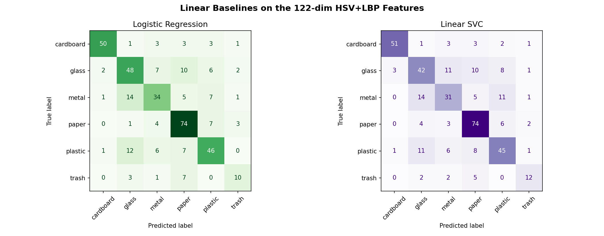
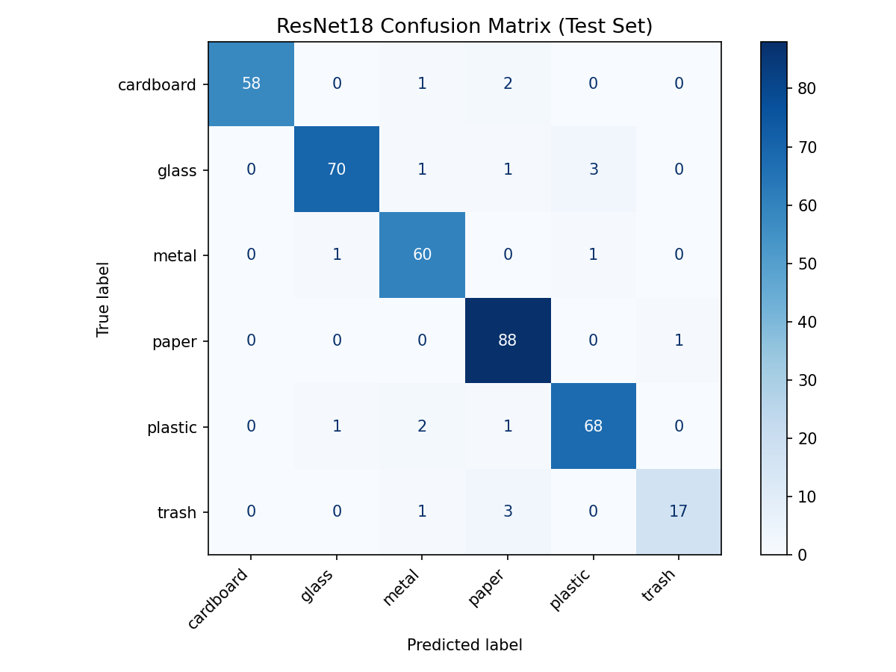
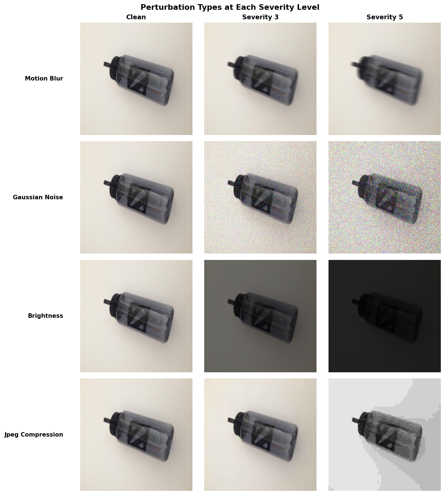
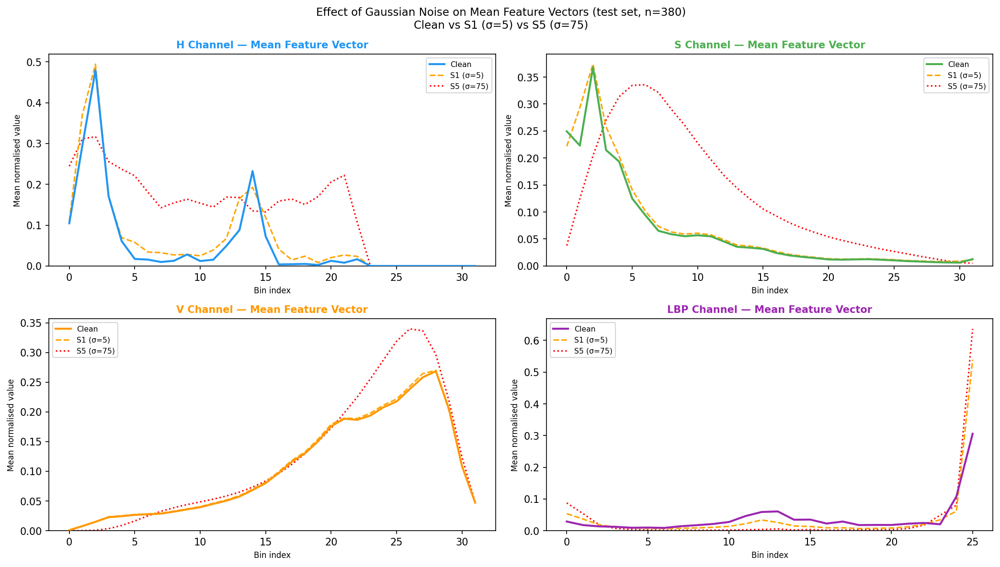
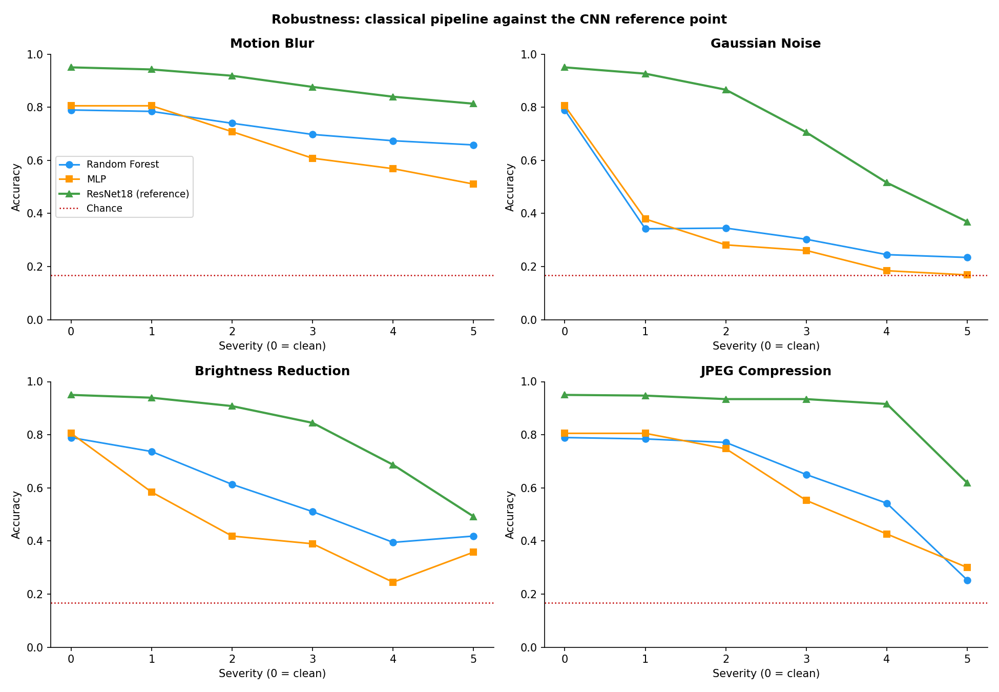
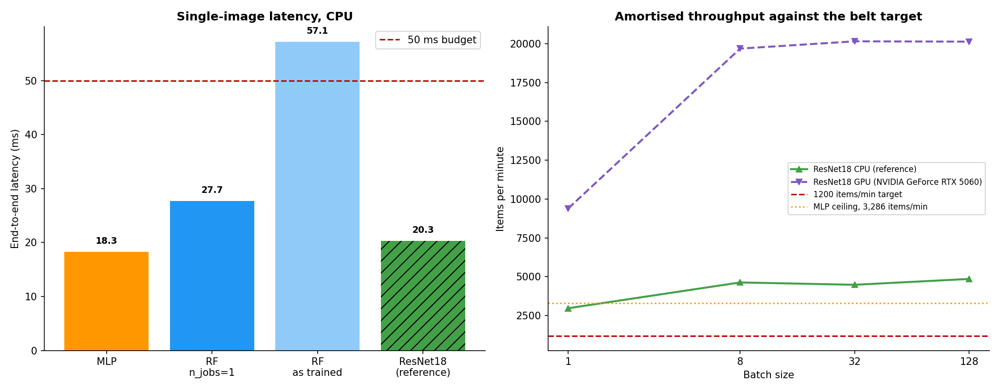

# Machine Learning for High-Performance Optical Sorting

**A deployment-oriented benchmark of five classical models against a fine-tuned CNN for automated waste sorting — scored on the things a recycling plant actually pays for: material purity, robustness to sensor degradation, and inference latency, not just accuracy.**

Mohamed Tawfeek · BSc final-year project, University of Sussex · Supervisor: Dr. Nick Hay

---

I built and compared a rule-based baseline, two linear models, a Random Forest and an MLP on the TrashNet dataset, then added a fine-tuned ResNet18 as a ceiling reference. Every model is scored on three axes that decide real deployments — industrial sorting metrics, robustness under simulated sensor failure, and latency against a 50 ms budget — and I audited my own headline result to see which conclusions actually held up. The whole classical pipeline trains in seconds on a CPU with no accelerator.

## Highlights

- **Evaluated like a production system, not a Kaggle entry.** Alongside accuracy and F1, every model is scored on material **purity, yield and recovery** — the precision/recall trade-off recycling plants tune — and against a **50 ms latency budget** derived from a real conveyor throughput target.
- **Found that clean accuracy doesn't decide deployment.** Under simulated sensor degradation the model ranking *flips*: the Random Forest beats the more-accurate MLP under motion blur and low light. The right model depends on the imaging environment, and I show why.
- **Caught a latency trap most benchmarks miss.** The Random Forest as trained (`n_jobs=-1`) *misses* the 50 ms budget that the exact same weights meet single-threaded — parallelising 200 trees over one prediction costs more in scheduling than it saves.
- **Audited my own results and corrected them.** The CNN's headline 95% was its best of five seeds; recomputed across all five it is 92.2% ± 1.8. I traced which conclusions that undercut and rewrote them, rather than reporting the flattering number.
- **Runs in ~30 seconds on a clean clone** — no dataset download, no training pass. Trained models and demo images are committed.

## Results

Test set, 380 images. The last row is a reference ceiling, not a sixth candidate.

| Model | Accuracy | Macro F1 | Purity | Yield | Recovery |
|---|---|---|---|---|---|
| Rule-based HSV baseline | 24.50% | 0.1749 | 0.2465 | 0.2152 | 0.1011 |
| Linear SVC | 67.11% | 0.6620 | 0.6742 | 0.6540 | 0.5082 |
| Logistic Regression | 68.95% | 0.6687 | 0.6841 | 0.6591 | 0.5141 |
| Random Forest | 78.95% | 0.7747 | 0.7993 | 0.7612 | 0.6381 |
| Multi-Layer Perceptron | 80.53% | 0.7914 | 0.7965 | 0.7876 | 0.6605 |
| *ResNet18 (reference)* | *95.00%* | *0.9408* | *0.9517* | *0.9324* | *0.8899* |

*Purity = precision, Yield = recall, Recovery = TP/(TP+FP+FN) — the standard sensor-based-sorting trade-off. The CNN row is the best of five seeds; across five it averages 92.2% ± 1.8, still twelve points clear of the MLP.*


The two linear models aren't deployment candidates — they exist to decompose the 54-point jump from baseline to Random Forest into its causes (better features vs. learned boundary vs. non-linearity). The short answer: the feature descriptor is the single largest step, worth about half the total.

---

## Key findings

### 1. The feature space, not the classifier, sets the accuracy ceiling

Every classical model makes the **same dominant error**: a near-symmetric glass↔metal confusion. Four model families with very different inductive biases fail at almost the same rate on the same pair, which points at the shared representation rather than any one model. Transparent glass lets the grey background dominate its colour histogram and metal is specular grey, so both land in the same region of the feature space. A fine-tuned CNN roughly halves the absolute error count — but the audit shows it does *not* reduce glass/metal's **share** of the errors that remain.

<details>
<summary><b>Read the full analysis (with the self-audit)</b></summary>

The glass/metal off-diagonal is the largest error for all four classical models: 16 images for the Random Forest, 17 for the MLP, 21 for logistic regression, 25 for the linear SVC. The weaker the model, the worse it breaks, and the linear models turn glass into an attractor rather than trading images evenly. Glass and metal are also the two weakest classes by F1 for every model.



**The CNN moves the pair — and here's where I audited my own claim.** A fine-tuned ResNet18 puts only 2 images on that off-diagonal at seed 42. Reported on its own that looks like the descriptor being the whole story. But 2 is the *best* of five seeds; across seeds 42, 1, 7, 13 and 99 the count is 7.6 ± 4.4, with a worst seed inside the range the classical models occupy. And the more telling number is the pair as a **share of total errors**:

| Model | pair total | total errors | pair as share of errors |
|---|---|---|---|
| Linear SVC | 25 | 125 | 20.0% |
| Logistic Regression | 21 | 118 | 17.8% |
| Random Forest | 16 | 80 | 20.0% |
| MLP | 17 | 74 | 23.0% |
| *ResNet18 fine-tuned, seed 42* | *2* | *19* | *10.5%* |
| *ResNet18 fine-tuned, five seeds* | *7.6 ± 4.4* | *29.8 ± 6.8* | *24.2% ± 11.8* |

The CNN's absolute count falls because its *total* errors fall (80 → 30), not because glass/metal got relatively easier. Across seven representations, from hand-set thresholds to a fine-tuned convolutional stack, this one pair accounts for roughly a fifth to a quarter of the errors every time. So the section has two claims and the audit separates them: **the representation sets the ceiling** (this survives — changing the representation is worth ~12 points where changing the classifier family was worth ~10 at most), but **glass/metal is a descriptor-specific artifact** does *not* survive — nothing tried here shrinks its share.

I also checked whether the CNN's edge is just memorised near-duplicates (TrashNet photographs the same object from multiple angles, so image-level splits leak). On frozen ImageNet features — independent of everything being compared — the CNN's ~14.5-point margin over the MLP holds across five similarity cutoffs, and both of its residual glass/metal errors are on the *least* similar test images, the opposite of what memorisation looks like.



</details>

### 2. Clean accuracy does not decide the deployment question

I applied four failure modes a conveyor sensor plausibly produces — motion blur, Gaussian noise, brightness reduction, JPEG compression — to the raw image at five severities each. The ranking from clean data doesn't survive. Under motion blur the Random Forest is **14.7 points ahead** of the MLP, a model it can't be separated from on clean data, with brightness reduction showing the same reversal. So model choice is conditional on the imaging environment: MLP in a controlled enclosure for its latency headroom, RF where blur or lighting can't be controlled.

<details>
<summary><b>Read the full analysis</b></summary>

Accuracy at worst-case severity (chance is 0.167):

| Perturbation | Random Forest | MLP | *ResNet18 (ref.)* |
|---|---|---|---|
| Motion blur | 0.658 | 0.511 | *0.813* |
| Gaussian noise | 0.234 | 0.168 | *0.368* |
| Brightness reduction | 0.418 | 0.358 | *0.492* |
| JPEG compression | 0.253 | 0.300 | *0.618* |

Motion blur carries the real signal; Gaussian noise defeats both classical models (nothing works in that region) and the JPEG gap is negligible.



**Why noise is a cliff, not a slope.** The colour histograms stop being class-specific as pixels scatter across bins; the LBP texture histogram collapses into its catch-all bin because noise breaks the smooth pixel transitions it depends on. I turned that into a testable prediction: a model that *doesn't* use the descriptor shouldn't fall off the cliff. At the mildest noise severity the RF drops from 0.789 to 0.342 and the MLP from 0.805 to 0.379, while the CNN goes from 0.950 to 0.926 — the classical pipeline loses half its accuracy to a perturbation that costs the CNN two points. That makes noise sensitivity a **descriptor problem first**, hardware second.




</details>

### 3. Feature extraction, not the classifier, owns the latency budget

Feature extraction costs 18.2 ms and is identical in every pipeline — **36% of the 50 ms budget spent before any model runs**. For the MLP the classifier itself is 0.10 ms, so the descriptor is effectively the whole pipeline. The Random Forest exposes a threading trap: as trained (`n_jobs=-1`) it takes 57.8 ms end-to-end and **misses** the budget, while the identical weights at `n_jobs=1` meet it at 27.7 ms — parallelising 200 trees over a single 122-feature prediction costs more in scheduling overhead than it saves.

<details>
<summary><b>Read the full analysis</b></summary>

Single-image CPU latency, end-to-end:

| Configuration | End-to-end | Within 50 ms? |
|---|---|---|
| RF, `n_jobs=1` | 27.7 ms | yes |
| RF, `n_jobs=-1` (as trained) | 57.8 ms | no |
| MLP | 18.5 ms | yes |
| *ResNet18 (ref.), 8 threads* | *20.3 ms* | *yes* |

A 2 m/s belt at 10 cm spacing needs 1,200 items/min. The RF at `n_jobs=1` clears it (~2,160/min), the MLP does comfortably (~3,240/min), and the RF as trained does *not* (~1,040/min).

**The CNN's fit is a whole-machine artifact, and I flagged it as one.** Its 20.3 ms end-to-end is real but spends eight cores; `src/features.py` is single-threaded and gets one. Matched core for core the ordering reverses — the single-thread CNN forward pass is 48.6 ms against the descriptor's 18.2 ms, and the CNN's single-thread end-to-end (51.2 ms) misses the budget the descriptor meets. Per core, the handcrafted descriptor is ~2.5× cheaper; the CNN only fits by spending cores the classical pipeline never asks for.

I also closed the obvious optimisation route by measuring it: **batching does nothing for extraction**, because it's a per-image Python loop (18.3 ms whether handed 1 image or 128). That leaves a compiled implementation or a cheaper descriptor — and since the LBP does a 24-neighbour comparison at every pixel in Python-level code, that's where the cost is.




</details>

---

## Run the demo

```bash
pip install -r requirements.txt
jupyter notebook demo/demo_classifier.ipynb
```

Runs on a clean clone — no dataset download, no training. It loads a real image, shows its HSV and LBP feature histograms, and runs both classifiers with confidence scores. It also puts a glass bottle and a tin can side by side that both models get exactly backwards, so you can see finding 1 directly rather than taking it on trust.

Every other notebook needs the full TrashNet dataset; see the collapsibles below.

---

<details>
<summary><b>Method</b></summary>

**Features (122 dimensions).** Images resized to 224×224 and converted to HSV. Three 32-bin normalised channel histograms give 96 colour dimensions; a uniform Local Binary Pattern descriptor (radius 3, 24 points) gives 26 texture dimensions. All extraction lives in `src/features.py` as a single source of truth, and notebook 02 asserts the module reproduces the step-by-step derivation exactly so training and evaluation can't drift apart.

**Split.** 2,527 images, stratified 70/15/15 into 1,769 train / 378 validation / 380 test, `random_state=42` throughout. Hyperparameters selected by 5-fold stratified CV on the training partition only; the test set was touched only after configurations were fixed. Where CV means were within noise, I took the configuration with the lowest fold-to-fold variance rather than the highest mean.

**Models.** Hand-tuned HSV thresholds (lower bound); logistic regression and linear SVC (C tuned by CV, StandardScaler refitted inside each fold); Random Forest (200 trees, unbounded depth); MLP (one hidden layer of 200 units, alpha 0.01, scaler fitted on training data only).

**CNN reference (notebook 16).** ImageNet-pretrained ResNet18, 6-way head, all layers unfrozen, 20 epochs of AdamW at lr 1e-4 with cosine decay, batch 32, epoch chosen on the same validation split. It sees the same pixels the descriptor does (identical resize path) and the only augmentation is a horizontal flip — which can't manufacture the robustness result, since none of the four perturbations are geometric.

**Auditing the CNN (notebook 17).** A frozen ImageNet probe and a from-scratch ResNet18 separate the contribution of pretraining from that of the TrashNet images; a near-duplicate audit sweeps five similarity cutoffs on two independent feature bases; and a five-seed sweep measures how much of the seed-42 result is the seed. Glass/metal is reported as a share of each model's errors alongside the raw count.

**Industrial metrics.** Purity = precision, Yield = recall, both standard in the sensor-based-sorting literature (Küppers et al. 2021; Maier et al. 2024). Recovery = TP/(TP+FP+FN), penalising output contamination and lost material in one number.

**Feature importance.** Permutation importance (block-permuted per H/S/V/LBP group, on the test partition) puts texture as the largest single group at 32.6% for the RF — revising the near-even split that mean-impurity-decrease reports, since MDI favours features offering more split points. This makes the case for fusing colour with texture an empirical result on this dataset rather than an argument from prior work.

</details>

<details>
<summary><b>Reproducing everything from scratch</b></summary>

Download TrashNet from https://github.com/garythung/trashnet and extract so that:

```
datasets/dataset-resized/{glass,paper,cardboard,plastic,metal,trash}/
```

Then run the notebooks in numerical order (01–02 build the feature matrix, 03–05 train and save models, 06 onward depend on those artifacts). The robustness sweep (06) takes ~20 minutes; the CNN notebooks (16–17) need PyTorch and take ~30–40 minutes on CPU.

`requirements.txt` pins scikit-learn to the minor version the committed pickles were written with, since scikit-learn does not guarantee pickle compatibility across releases. The CNN weights (`cnn_final_model.pt`, 43 MB) are gitignored and regenerated by notebook 16; everything scored from them is committed as CSV/JSON/`.npy`. **Run notebook 16 before 17.**

**Repository layout:**

```
src/         features.py · metrics.py · perturbations.py · split.py   (canonical, imported everywhere)
notebooks/   01–17, numbered in dependency order
demo/        demo_classifier.ipynb + the three images it classifies
results/     committed pickles, confusion matrices, metrics, figures
```

</details>

<details>
<summary><b>Technical notes</b></summary>

**Class ordering.** scikit-learn orders classes alphabetically, which is not the order of the `CLASSES` list. Every per-class output uses `CLASS_ORDER = sorted(CLASSES)` passed as `labels=`, because passing an unsorted list silently mislabels every result without raising — the support column still sums and the diagonal still looks like a diagonal. (An earlier version of this analysis identified the wrong confusion pair for exactly this reason; the assert now prevents it.)

**Resize filter matters.** LBP shifts ~1.6% under a change of resize filter alone — three times more than the colour histograms, because it measures local contrast. The pipeline pins Pillow's default bicubic filter and asserts it, after an early version used different filters in different stages.

**CNN reproducibility.** Seed-42 retraining recovers the committed model exactly. Scoring the committed weights is device-sensitive: on CPU or CUDA-batch-64, one borderline test image flips and accuracy reads 94.74% instead of 95.00% — worth knowing before reading into small error counts.

**Split transfer across representations.** `split_indices` in `src/split.py` derives the same partition as positional indices, so a raw-image model is evaluated on exactly the same test images as a feature-matrix model. Notebook 16 asserts this rather than relying on the reasoning.

</details>

---

## How to read the numbers

TrashNet is single objects on a light background under controlled lighting. Real belt imagery has overlap, occlusion, contamination and motion. Every number here is an **upper bound** on deployment performance, not an estimate of it — the value of the project is in the *relative* comparisons and the failure analysis, not the absolute accuracies.

## References

Friedrich et al. (2022), *MethodsX* 9, 101686 · Küppers et al. (2021), *Waste Management & Research* 39(1) · Maier et al. (2024), *IEEE Access* 12 · Mesina et al. (2007), *Int. J. Mineral Processing* 82(4) · Smith et al. (2019), *Minerals Engineering* 133 · Thung & Yang (2016), TrashNet, Stanford CS229. Full citations in the collapsibles and notebooks.

## Dataset and licence

TrashNet, 2,527 images across six classes, from Thung & Yang (2016). Not redistributed here apart from the three images under `demo/images/` that keep the demo self-contained. Code released under the MIT Licence — see [LICENSE](LICENSE).
